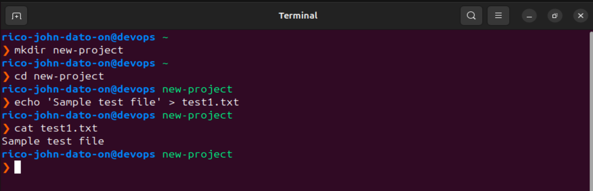
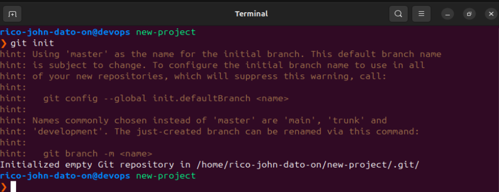
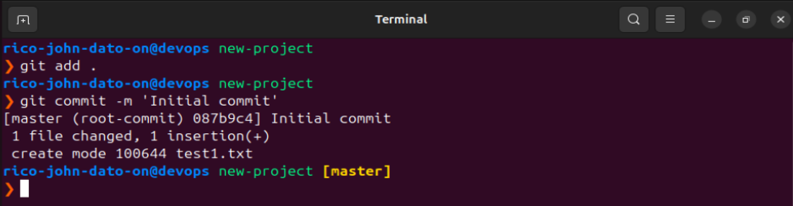
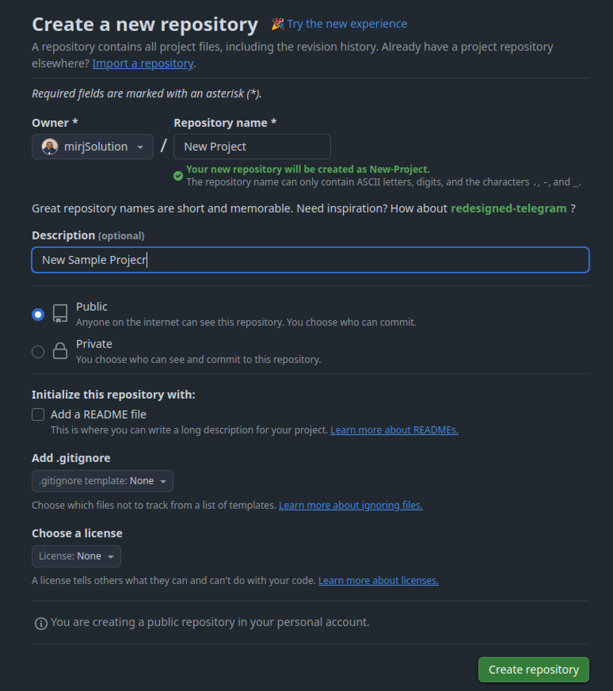
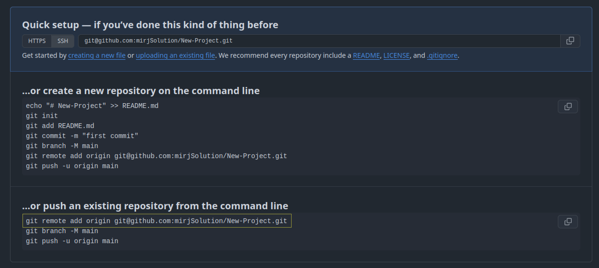
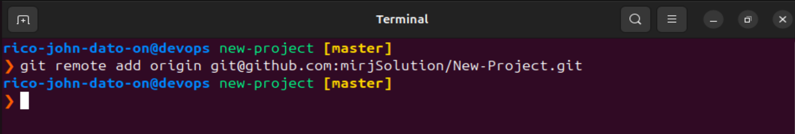
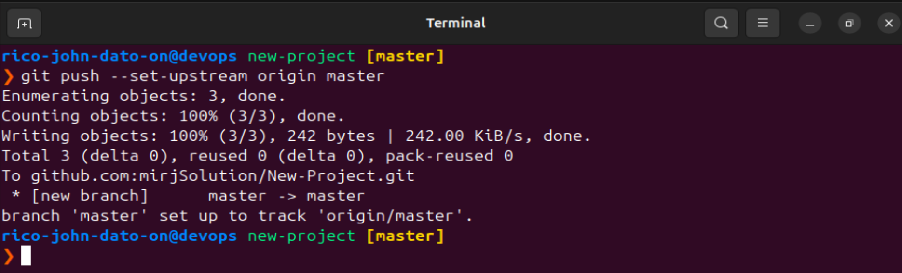
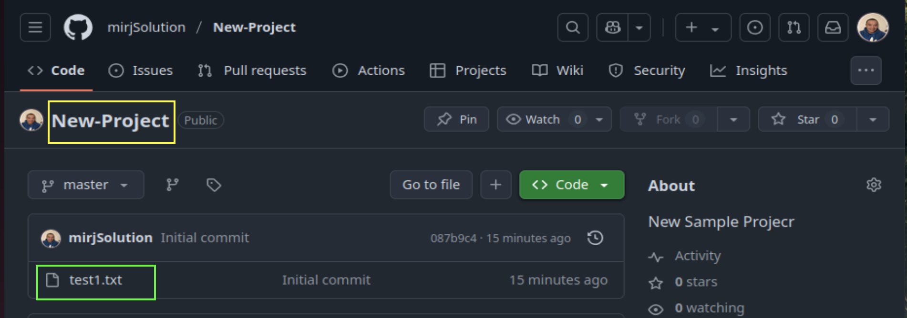

# 🚀 Pushing an Existing Project to a Git Remote Repository

This guide explains how to take an existing project on your local machine and push it to a Git remote repository like GitHub or GitLab.

## 🛠️ Scenario: You Have Local Code, No Git Repo

You’ve built a local project and now want to version-control it and back it up to a remote Git repository. Here's how you can do that.

---

## 📍 Steps Overview

### Create a local project on your local machine

```bash
mkdir new-project
cd new-project
echo 'Sample test file' > test1.txt
cat test1.txt
```



# 🚀 Pushing an Existing Project to a Git Remote Repository

### Initialize a Local Git Repository

```bash
git init
```

This creates a `.git` folder that enables Git tracking.



### Stage Your Files and Commit the Changes

```bash
git add .
git commit -m "Initial commit"
```



### Create a Remote Repository

Use GitHub/GitLab UI to create a new **empty** repo (don’t add README or .gitignore yet).



### Connect Local Repo to Remote

In your Github repo copy the git clone



And paste it in your terminal

```bash
git remote add origin <remote_repo_url>
```

This sets the destination for pushing code.



### Push and Set the Upstream Branch

```bash
git push --set-upstream origin master
```

This connects your local branch (e.g. `master`) to the remote and pushes your code.



On your github when you refresh or open your new project repo you should see the test1.txt file that we created



---

## 🧠 Important Concepts

- `.git` directory stores config, history, and branch data.
- Removing `.git` will disconnect the project from Git tracking.
- You can reconnect later by reinitializing and re-linking the repo.

---

## 🧑‍💻 Pro Tip

Always check `git status` to see what’s going on in your repo.
Use `git log` to review commit history.

🧑‍💻 _Created by Rico John Dato-on_
🔗 [LinkedIn](https://www.linkedin.com/in/rico-john-dato-on) • [Portfolio](https://ricodatoon.netlify.app)

---
